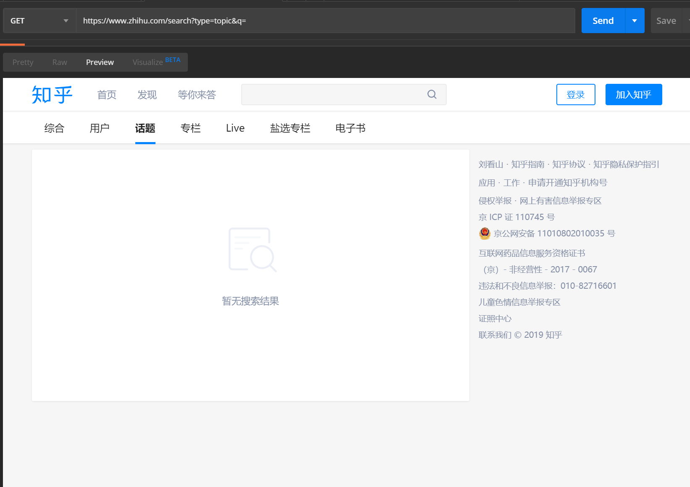
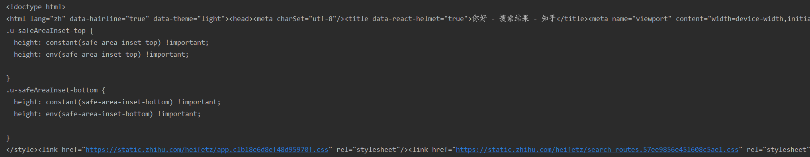
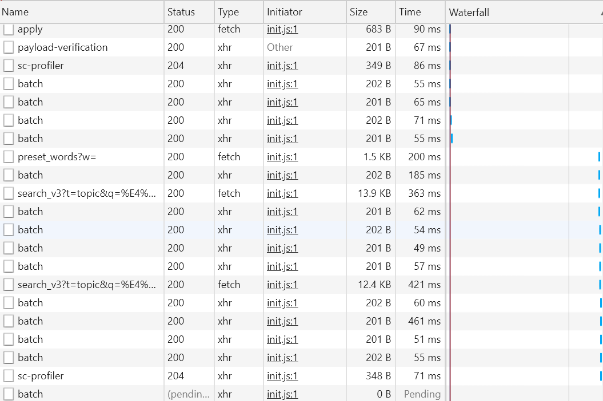
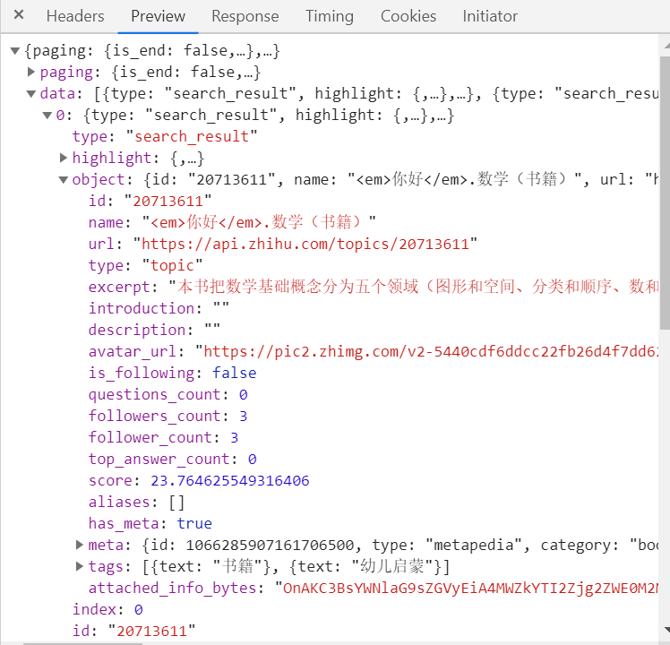
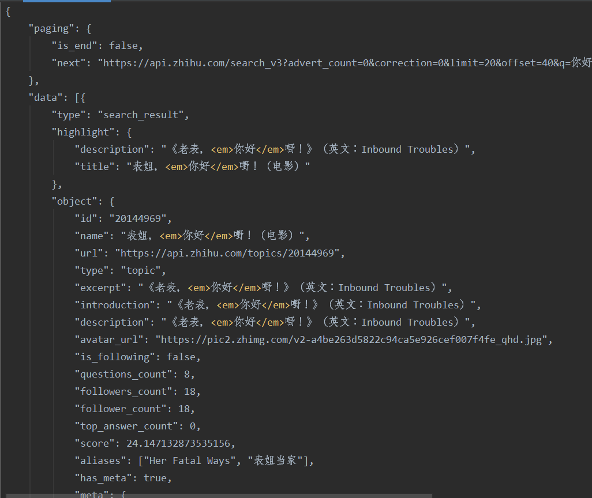

# 知乎笔记

## 一、使用说明

运行前的提醒事项：

### 1、安装依赖库

安装requirements.txt依赖
pip install -r requirements.txt

### 2、登陆说明

爬虫调用的是个人的cookie信息，第一次使用需要输入账号密码以及英文数字的验证码，经过验证之后该cookie会保存下来，以后可以直接运行。

### 3、额外说明

需要额外说明的是，记得要安装[node.js]( https://nodejs.org/zh-cn/ )

## 二、概述

该项目的运行环境：

Windows10、Python3.7.4

该项目结构：

zhihuspider:
│  captcha.jpg
│  encrypt.js
│  README.md
│  requirements.txt
│  zhihu_answer.py
│  zhihu_child_comment.py
│  zhihu_comment.py
│  zhihu_login.py
│  zhihu_question.py
│  zhihu_question_info.py
│  zhihu_topic.py
│
├─docs
│      “面向知乎QAWEB的网络爬虫设计与实现”软件课设任务书.doc
│      “面向知乎QAWEB的网络爬虫设计与实现”软件课设指导书.doc

该项目可以对知乎的某话题、某话题下的问题以及问题信息、某问题下的回答、某回答下的评论和某评论下的子评论进行爬取，并存入指定的csv文件中。

## 三、爬虫过程介绍

该爬虫基本思路是：

登录知乎

==》知乎话题搜索页

==》找出知乎话题搜索结果页面包含话题信息的api，爬取所有话题的url，title和description

==》找出知乎话题页面包含问题的api，爬取所有问题的url和title

==》同上找出api，爬取问题下回答的answer_id、content、author_name、voteup_count、comment_count

==》同上找出api，爬取回答下评论的comment_id、comment_content、comment_author_name、comment_vote_count、child_comment_count

==》同上找出api，爬取评论下子评论的child_comment_id、child_comment_content

==》单独分析问题页面，借用xpath找到问题本体，问题描述，浏览数、关注数和提问题者

### 1、模拟登陆

逆向破解过程：[lateautumn4lin的github项目](https://github.com/lateautumn4lin/Review_Reverse)、[博客](https://cloudcrawler.club/)

模拟登陆：[模拟登陆（可用）](https://github.com/zkqiang/zhihu-login)

### 2、爬取知乎话题（topic）

我尝试了知乎的搜索端口，发现可以实现免登录搜索话题，我们可以借用这个[查询入口](https://www.zhihu.com/search?type=topic&q=)可以直接搜索话题，用postman不带`headers`直接发送请求，我们可以看到下面的结果：



证明可以使用该入口进行查询爬取。

但由于我们要求先进入[知乎](http://www.zhihu.com)页面，因此我们在这里添加了模拟登陆的模块先登陆，保持会话，进而访问页面获取我们想要的数据，详细的过程如下：

#### 1）分析

登陆之后随便在话题搜索界面搜索一下，假如搜索`你好`结果返回正常，那么我们在代码里面用`requests`来访问一下：



可以发现，该页面的大部分数据都是`json/text`类型返回的，而且混在一起放在`<script>`标签里，既然是`js`记载出来的，那么就一定有返回给他的`json数据`，下拉页面，知乎会使用瀑布流加载数据，如图：



就会发现有一个url频繁出现，有可能是我们所需要的url，如图：



可以发现该url返回的数据包含了我们所需要的数据，那么这个大概率是我们可以用来爬取数据的api，那么我们可以用下面的代码先试验一下

``` python
import requests

headers = {
            'User-Agent': "Mozilla/5.0 (Macintosh; Intel Mac OS X 10_14_6) AppleWebKit/537.36 (KHTML, like Gecko) Chrome/77.0.3865.120 Safari/537.36",
            'Accept': "*/*",
            'Cache-Control': "no-cache",
            'Accept-Encoding': "gzip",
            'Connection': "keep-alive",
            'cache-control': "no-cache"
        }
url = 'https://www.zhihu.com/api/v4/search_v3'
querystring = {"t": "topic",
               "q": "你好",
               "correction": "0",
               "offset": "20",
               "limit": "20",
               }
response = requests.get(url, headers=headers, params=querystring)
print(response.text)

```

成功的得到了topic搜索结果：



那么接下来很简单了，将获得的`json数据`进行处理筛选得到我们想要的数据，并存入相应的文件中即可。

另经过多次试验，在访问知乎话题的`params`的参数有以下的含义：

- `t`：控制爬取的项目（大概有content、topic等等）
- `q`：搜索的关键词
- `correction` : 0的话会把热点信息加上，1没有
- `offset` : 相当于页面的偏置
- `limit` : 每页显示数据条数
- `lc_idx` : 会和`offset`一起变化，每次增加数量为上一页的`offset`数量，去掉没啥影响
- `show_all_topics` : 显示所有话题，没啥用，可以砍掉
- `search_hash_id` : 测试无影响
- `vertical_info` : 测试无影响

那么我们解决了如何爬取一页结果的问题，那么接下来就是怎么把整个搜索结果全部爬取下来的问题。

我们前面提到了搜索的api，那么我们其实只要修改offset这个参数即可实现把相关搜索结果全部爬取下来。我们可以发现，在api返回的`json`数据中有一项`paging`的参数`is_end`可以帮助我们判断是否结束爬取，若`is_end`的值是`True`，则是最后一页结束爬取，若是`False`则继续爬取。初次之外，还可以在`json`中找到`next`的参数，里面是下一页的url，那么我们就有了解决这个问题的基本思路：

- 请求第一次，判断是否有下一页，保存返回结果并获取下一页的url
- 循环请求下一页，判断是否有下一页，保存返回结果并获取下一页的url
- 请求到最后一页的`is_end`为`True`，没有下一页的url，保存返回结果，存储数据

但在自己爬取的过程中出现了状况，用requests的get请求访问下一页的url时，并不能有效返回，出现了error的页面，那我们只能循环改变offset的值来爬取下一页。

这样我们就基本解决了爬取搜索结果中所有话题（topic）的问题。

#### 2）完整代码

请参看zhihu_topic.py文件

### 3、爬取知乎某话题下问题（question）

基本思路同上，不写了

（对应zhihu_question.py）

### 4、爬取知乎某问题下的回答（answer）

问题下的回答部分基本思路同上，不写了（对应zhihu_answer.py）

问题本身的标题、描述、关注数、浏览数和提出问题的用户这些信息并不能从api中获取，经过对网页的分析，可以知道这部分可以直接利用xpath从网页中获取。

#### 1）关注数和浏览数

查找该部分的正则表达式

```
//*[@class="NumberBoard-itemValue"]/@title
```

查找出来的结果包含了关注数和浏览数

#### 2）问题的标题和描述

这部分中的描述并不能很好的直接获取，问题出现在有的问题描述过长会被知乎网页截断，直接获取不能获取描述的全部信息，因此经过多次尝试，发现在点击知乎`显示全文`的按钮时，会向一个url发送post，而且发现在不同的问题下我们发送的url地址一致，那么我们就可以利用requests模拟发送这么一条post，进而使得问题的描述全部显示出来。

爬取问题标题的正则表达式：

```
//*[@class="QuestionHeader-title"]/text()
```

爬取问题描述的正则表达式：

```
//*[contains(@class, "QuestionRichText")]/div/span/text()
```

#### 3）问题提出者

这个可以在知乎问题的问题日志里面找出来，日志最下面的一条便是提出问题的用户，按顺序爬取即可

爬取问题提出者name的正则表达式：

```
//*[@class="zm-item"]/div[1]/a/text()
```

爬取问题提出者主页地址的正则表达式：

```
//*[@class="zm-item"]/div[1]/a/@href
```

### 5、爬取知乎某回答下的评论（comment）

基本思路同上，不写了

（对应zhihu_comment.py）

### 6、爬取知乎某评论下的子评论（child_comment）

基本思路同上，不写了

（对应zhihu_child_comment.py）

### 7、爬取知乎某问题的相关信息（question_info）

基本思路同上，不写了

（对应zhihu_question_info.py）

## 四、参考

- [崔庆才的书（python3网络爬虫开发实战）](https://python3webspider.cuiqingcai.com/)（主要参考了Ajax和xpath部分）
- 逆向破解过程：[lateautumn4lin的github项目](https://github.com/lateautumn4lin/Review_Reverse)、[博客](https://cloudcrawler.club/)
- 模拟登陆：[模拟登陆（可用）](https://github.com/zkqiang/zhihu-login)

